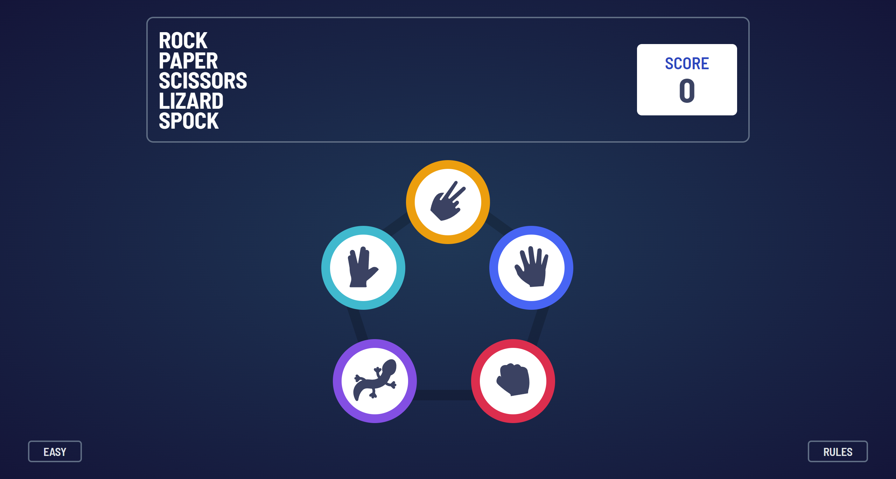

# Frontend Mentor - Rock, Paper, Scissors solution

This is a solution to the [Rock, Paper, Scissors challenge on Frontend Mentor](https://www.frontendmentor.io/challenges/rock-paper-scissors-game-pTgwgvgH). Frontend Mentor challenges help you improve your coding skills by building realistic projects.

## Table of contents

- [Overview](#overview)
  - [The challenge](#the-challenge)
  - [Screenshot](#screenshot)
  - [Links](#links)
- [My process](#my-process)
  - [Built with](#built-with)
  - [What I learned](#what-i-learned)
  - [Continued development](#continued-development)
  - [Useful resources](#useful-resources)
- [Author](#author)
- [Acknowledgments](#acknowledgments)

## Overview

### The challenge

Users should be able to:

- View the optimal layout for the game depending on their device's screen size
- Play Rock, Paper, Scissors against the computer
- Maintain the state of the score after refreshing the browser _(optional)_
- **Bonus**: Play Rock, Paper, Scissors, Lizard, Spock against the computer _(optional)_

### Screenshot



### Links

- Solution URL: [Github](https://github.com/karthik2265/rock-paper-scissor-game)
- Live Site URL: [rock-paper-scissors-game](https://rock-paper-scissor-game-hc0hq7y3h-karthik2265.vercel.app/)

## My process

### Built with

- Flexbox
- CSS Grid
- Desktop-first workflow
- [React](https://reactjs.org/) - JS library
- [React Router](https://reactrouter.com/) - For navigation
- [Framer Motion](https://www.framer.com/motion/) - For animations

### What I learned

I have learnt how to use **framer motion** to build cool animations in react app.The framer motion library makes it very easy to uild complex animations planning to use it in other projects.

setting **height: 100vh does not work for mobile browsers**, scrool bar appears. To avoid this I had to use javascript to set the height of the App in useEffect hook.

```js
useEffect(() => {
  const App = document.getElementById('App')
  App.style.height = +window.innerHeight + 'px'
}, [])
```

I have learnt how to modularize code and make reuseable components

### Useful resources

- [Framer motion youtube tutorial](https://www.youtube.com/watch?v=1vKiPwEYbyk) - This helped me learn framer motion. The instructor, laith harb explains the concepts very well.

## My Notes

- should have made components like rock, paper.. etc and re-use them where ever needed.
